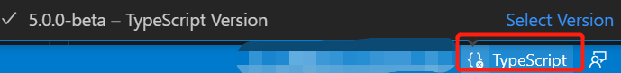

# Contribute

## Introduction

First,Thank you for contributing to unplugin-vue-macro!

we welcome any type of contribution,not only code! you can help with:
- **QA**:  You can use [open issues](https://github.com/sxzz/unplugin-vue-macros/issues) file bug reports, the more details you can give the better -links or repos that demonstrate the specific issue.Even if you can't write code, commenting on them, showing that you care about a given issue matters. It helps us triage them.
- **Money**: we welcome financial contributions 

## Your First Contribution
 Working on your first pull request? you can learn how from this _free_ course,[How to Contribute to an Open Source Project on GitHub](https://egghead.io/courses/how-to-contribute-to-an-open-source-project-on-github).

## how to run and test on your local machine
first `pnpm install`,you must install all dependencies.

**The very important**:Because this project based on `"typescript": "5.0.0-beta"` ,you must be check your compiler version before you run and test.If your editor is vscode ,You can check the compiler version or select the version through this  button.

with `pnpm  test` you can run all tests, if you only  want to run specific package tests ,you can run with `pnpm test packages/xxx` .
   
More commands are in  `package.json` file.
   
## Submitting code
 Any code change should be submitted as a pull request.The description should explain what the code does and does give steps to excutes it.The pull request should also contain tests.