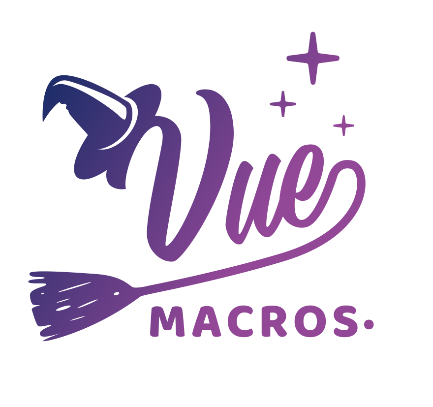

<p align="center">
  
</p>

<h1 align="center">Vue Macros</h1>

<p align="center">Explore more macros and syntax sugar to Vue.</p>

<p align="center">
  <a href="https://npmjs.com/package/unplugin-vue-macros">
    
  </a>
</p>

<p align="center">
  <a href="https://vue-macros.sxzz.moe/">📜 Documentation</a>
</p>

## Features

- ✨ Explore more macros and syntax sugar to Vue.
- 💚 Supports both Vue 2.7 and Vue 3 out-of-the-box.
- 🦾 Full TypeScript / Volar support.
- ⚡️ Supports Vite, Nuxt, Webpack, Vue CLI, Rollup 3, esbuild and more, powered by [unplugin](https://github.com/unjs/unplugin).

## Installation

```bash
npm i unplugin-vue-macros -D
```

## Sponsors

<p align="center">
  <a href="https://cdn.jsdelivr.net/gh/sxzz/sponsors/sponsors.wide.svg">
    
  </a>
</p>

## Contributors

💕 Thank you to all the contributors!

<p align="center">
  <a href="https://github.com/sxzz/vue-macros/graphs/contributors">
    
  </a>
</p>

## Related Libraries

- [vue-functional-ref](https://github.com/sxzz/vue-functional-ref) - Functional-style refs for Vue.

## License

[MIT](./LICENSE) License © 2022-PRESENT [三咲智子](https://github.com/sxzz)
